## Learn Javascript
The curriculum extract of the course at [Learn Javascript](https://learnjavascript.today) by [Zell Liew](https://zellwk.com/). Since I cannot afford the course, I choose to follow the curriculum, build some projects around it and work hard to master the front-end side of Javascript. I'd definitely do the same thing for Node.js and like the repository here.

> Outline are in checklist format (task), when each task is done, it is crossed.

### Module 1 <small>Javascript and its Ecosystem</small>
1. [ ] What is Javascript used for?
2. [ ] The Javascript Ecosystem
3. [ ] Varying versions of Javascript

### Module 2 <small>Javascript Basics</small>
1. [ ] Linking your Javascript Files
2. [ ] Preparing your text editor
3. [ ] The Console
4. [ ] Comments
5. [ ] You don't need semicolons
6. [ ] Strings Numbers and Booleans
7. [ ] Declaring Variables
8. [ ] Functions
9. [ ] Arrow Functions
10. [ ] Intro to Objects
11. [ ] if/else Statements
12. [ ] The NOT Operator
13. [ ] Null and Undefined
14. [ ] The BOM and the DOM
15. [ ] Selecting Elements
16. [ ] Changing classes
17. [ ] Listening to Events
18. [ ] Callbacks

### Module 3 <small>Building simple components</small>
1. [ ] How to think like a Developer
2. [ ] How to use the starter template
3. [ ] Do this for every component
4. [ ] **Hands On**: Building an Off-canvas Menu
5. [ ] **Hands On**: Building a modal window
6. [ ] Lessons from building process
7. [ ] Debugging errors
8. [ ] How to use a linter

### Module 4 <small>Arrays and Loop</small>
1. [ ] Intro to arrays
2. [ ] For loops
3. [ ] The forEach Loop
4. [ ] Selecting multiple elements
5. [ ] Node vs Elements
6. [ ] **Hands On**: Building an accordion

### Module 5 <small>DOM Basics</small>
1. [ ] Id, classes, tags, attributes
2. [ ] Changing CSS with Javascript
3. [ ] Getting CSS with Javascript
4. [ ] Changing attributes
5. [ ] Finding an Element's size and position
6. [ ] DOM Traversal
7. [ ] **Hands On**: Building a tabbed component
8. [ ] **Hands On**: Carousel: HTML and CSS
9. [ ] **Hands On**: Carousel: Switching slides with Javascript
10. [ ] **Hands On**: Carousel: working with dots
11. [ ] **Hands On**: Carousel: Positioning slides with Javascript

### Module 6 <small>Events deep dive</small>
1. [ ] The listening element
2. [ ] Default behaviours
3. [ ] Event propagation
4. [ ] Event Delegation
5. [ ] Removing Event listeners
6. [ ] **Hands On**: Modal: Closing the Modal
7. [ ] **Hands On**: Accordion: Event delegation
8. [ ] **Hands On**: Tabby: Event Delegation
9. [ ] **Hands On**: Carousel: Event Delegation

### Module 7 <small>Transitions and animations</small>
1. [ ] CSS transitions
2. [ ] CSS animations
3. [ ] Silky-smooth animations
4. [ ] Integrating CSS animations and transitions with Javascript
5. [ ] Javascript animations
6. [ ] The Greensock Animation API (GSAP)
7. [ ] **Hands On**: Modal: Animating the modal
8. [ ] **Hands On**: Modal: Animating the pointing hand
9. [ ] **Hands On**: Modal: Animating the waving hand
10. [ ] **Hands On**: Modal: Wave hand animation with Javascript (using GSAP)
11. [ ] **Hands On**: Accordion: Animations
12. [ ] ** Hands On**: Carousel: Animations

### Module 8 <small>Useful Javascript features</small>
1. [ ] Ternary operators
2. [ ] AND and OR operators
3. [ ] Early returns
4. [ ] Template literals
5. [ ] Destructuring
6. [ ] Default Parameters
7. [ ] Enhanced object literals
8. [ ] Rest and Spead operators
9. [ ] Useful array methods
10. [ ] Reduce
11. [ ] Looping through objects
12. [ ] Returning objects with implicit return
13. [ ] **Hands On**: Accordion: Useful Javascript features
14. [ ] **Hands On**: Tabby: Useful Javascript features
15. [ ] **Hands On**: Carousel: Useful Javascript features

### Module 9 <small>Javascript best practices</small>
1. [ ] Write declarative code
2. [ ] Functions with purpose
3. [ ] Manage scope
4. [ ] Reduce state changes
5. [ ] Don't reassign
6. [ ] Don't mutate
7. [ ] Preventing objects from mutating
8. [ ] Preventing Arrays from mutating
9. [ ] Write pure functions
10. [ ] **Hands On**: Accordion: Refactor
11. [ ] **Hands On**: Carousel: First Refactor
12. [ ] **Hands On**: Carousel: Refactoring the dots parts
13. [ ] **Hands On**: Carousel: Previous and Next Buttons
14. [ ] **Hands On**: Carousel: Second Refactor

### Module 10 <small>Creating HTML elements</small>
1. [ ] Changing text and HTML
2. [ ] Creating HTML elements
3. [ ] Adding multiple elements to the DOM
4. [ ] Removing elements from the DOM
5. [ ] **Hands on**: Carousel: Creating dots with JavaScript
6. [ ] **Hands on**: Calculator: HTML and CSS
7. [ ] **Hands on**: Calculator: Happy Path
8. [ ] **Hands on**: Calculator: Edge Cases
9. [ ] **Hands on**: Calculator: Refactoring part 1
10. [ ] **Hands on**: Calculator: Refactoring part 2
11. [ ] **Hands on**: Calculator: Refactoring part 3
12. [ ] **Hands on**: Popover: Making one popover
13. [ ] **Hands on**: Popover: Making four popovers
14. [ ] **Hands on**: Popover: Making popovers with JavaScript

### Module 11 <small>Forms</small>
1. [ ] Intro to forms
2. [ ] Selecting form fields with JavaScript
3. [ ] Form fields and their events
4. [ ] Sanitize your output
5. [ ] Generating unique IDs
6. [ ] **Hands on**: Popover: Dynamic ID
7. [ ] **Hands on**: Todolist: The HTML and CSS
8. [ ] **Hands on**: Todolist: Creating tasks with JavaScript
9. [ ] **Hands on**: Todolist: Deleting tasks with JavaScript
10. [ ] **Hands on**: Typeahead: The HTML and CSS
11. [ ] **Hands on**: Typeahead: Displaying predictions
12. [ ] **Hands on**: Typeahead: Selecting a prediction
13. [ ] **Hands on**: Typeahead: Bolding search terms

### Module 12 <small>Asynchronous Javascript</small>
1. [ ] Introduction to Ajax
2. [ ] Understanding JSON
3. [ ] The Fetch API
4. [ ] Possible data types
5. [ ] JavaScript Promises
6. [ ] Requests and responses
7. [ ] Sending post requests
8. [ ] Authentication
9. [ ] Handling errors
10. [ ] Viewing response headers
11. [ ] CORS and JSONP
12. [ ] XHR or Fetch
13. [ ] Using an Ajax library
14. [ ] Understanding API Documentations
15. [ ] Understanding CURL
16. [ ] **Hands on**: Todolist: The Todolist API
17. [ ] **Hands on**: Todolist: Fetching tasks
18. [ ] **Hands on**: Todolist: Creating tasks
19. [ ] **Hands on**: Todolist: Editing tasks
20. [ ] **Hands on**: Todolist: Deleting tasks
21. [ ] **Hands on**: Todolist: Creating tasks with Optimistic UI
22. [ ] **Hands on**: Todolist: Handling Optimistic UI errors
23. [ ] **Hands on**: Todolist: Editing tasks with Optimistic UI
24. [ ] **Hands on**: Todolist: Deleting tasks with Optimistic UI
25. [ ] **Hands on**: Todolist: Refactor
26. [ ] **Hands on**: Typeahead: How to add Ajax
27. [ ] **Hands on**: Typeahead: Adding Ajax
28. [ ] **Hands on**: Typeahead: Handling errors
29. [ ] **Hands on**: Google Maps Clone: Creating your first Google Map
30. [ ] **Hands on**: Google Maps Clone: Fetching JSONP via JavaScript
31. [ ] **Hands on**: Google Maps Clone: Drawing directions
32. [ ] **Hands on**: Google Map Clone: Driving directions
33. [ ] **Hands on**: Google Map Clone: Handling errors
34. [ ] **Hands on**: Google Map Clone: Adding stopovers
35. [ ] **Hands on**: Google Map Clone: Refactor
36. [ ] **Hands on**: Dota Heroes: Listing heroes
37. [ ] **Hands on**: Dota Heroes: Filtering heroes (Part 1)
38. [ ] **Hands on**: Dota Heroes: Filtering heroes (Part 2)
39. [ ] **Hands on**: Dota Heroes: Refactoring

### Module 13 <small>Advanced asynchronous Javascript</small>
1. [ ] Requesting many resources at once
2. [ ] Getting Response headers in JavaScript
3. [ ] Dealing with paginated responses (part 1)
4. [ ] Dealing with paginated responses (part 2)
5. [ ] Async and await
6. [ ] Timeouts
7. [ ] Async loops
8. [ ] Recursive XHR

### Module 14 <small>Dates</small>
1. [ ] The Date Object
2. [ ] Getting a formatted date
3. [ ] Getting the time
4. [ ] Local time and UTC Time
5. [ ] Setting a specific date
6. [ ] Setting a date with Date methods
7. [ ] Adding (or subtracting) date and time
8. [ ] Comparing Dates and times
9. [ ] **Hands on**: Datepicker: Initial HTML and CSS
10. [ ] **Hands on**: Datepicker: Building the calendar
11. [ ] **Hands on**: Datepicker: Building the datepicker with JavaScript
12. [ ] **Hands on**: Datepicker: Previous and next buttons
13. [ ] **Hands on**: Datepicker: Selecting a date
14. [ ] **Hands on**: Datepicker: Positioning the datepicker
15. [ ] **Hands on**: Datepicker: Showing and hiding
16. [ ] Formatting a date with toLocaleString
17. [ ] setTimeout
18. [ ] setInterval
19. [ ] **Hands on**: Countdown: The HTML and CSS
20. [ ] **Hands on**: Countdown: The JavaScript
21. [ ] **Hands on**: Countdown: Counting months
22. [ ] **Hands on**: Countdown: Daylight Saving Time
23. [ ] **Hands on**: Countdown: Counting years

### Module 15 <small>Scroll, mouze and resize events</small>
1. [ ] Handling Scroll events
2. [ ] Handling Mouse events
3. [ ] Handling Touch events
4. [ ] **Hands on**: Building an auto-hiding sticky nav
5. [ ] **Hands on**: Building a same-page-scroll link
6. [ ] **Hands on**: Building an infinite-scrolling page
7. [ ] **Hands on**: Building a scrollspy
8. [ ] **Hands on**: Building a drag & drop component
9. [ ] **Hands on**: Improving the carousel
10. [ ] **Hands on**: Improving the date picker

### Module 16 <small>Keyboard</small>
1. [ ] Keyboard users
2. [ ] Handling commonly used keys
3. [ ] Keyboard events
4. [ ] Understanding Tabindex
5. [ ] Detecting the focused element
6. [ ] Directing focus
7. [ ] Preventing people from tabbing into elements
8. [ ] How to choose keyboard shortcuts
9. [ ] Creating single-key shortcuts
10. [ ] Keyboard shortcuts with Command and Control modifiers
11. [ ] **Hands on**: Off-canvas: Adding keyboard interaction
12. [ ] **Hands on**: Modal: Adding keyboard interaction
13. [ ] **Hands on**: Accordion: Adding keyboard interaction
14. [ ] **Hands on**: Tabby: Adding keyboard interaction — updated!
15. [ ] **Hands on**: Tabby: Refactoring
16. [ ] **Hands on**: Carousel: Adding keyboard interaction — updated!
17. [ ] **Hands on**: Carousel: Displaying help text
18. [ ] **Hands on**: Calculator: Adding keyboard interaction
19. [ ] **Hands on**: Popover: Keyboard
20. [ ] **Hands on**: Popover: Refactor
21. [ ] Keyboard shortcuts with Command and Control modifiers
22. [ ] **Hands on**: Todolist: Keyboard
23. [ ] **Hands on**: Typeahead: Keyboard
24. [ ] **Hands on**: Typeahead: Selecting a prediction with the keyboard
25. [ ] **Hands on**: Typeahead: Selecting a prediction with the keyboard
26. [ ] **Hands on**: Google Maps Clone: Keyboard
27. [ ] **Hands on**: Dota Heroes: Keyboard
28. [ ] **Hands on**: Datepicker: Tabbing in and out
29. [ ] **Hands on**: Datepicker: Keyboard shortcuts

### Module 17 <small>Accessibility</small>
1. [ ] What is accessibility?
2. [ ] How to use a screen reader
3. [ ] Using NVDA
4. [ ] Using Voiceover
5. [ ] Aria roles
6. [ ] Landmark roles
7. [ ] Document structure roles
8. [ ] Live region roles
9. [ ] Widget roles
10. [ ] Window and Abstract roles
11. [ ] Accessible names and descriptions
12. [ ] Hiding content
13. [ ] How CSS affects ARIA
14. [ ] ARIA properties and ARIA states
15. [ ] ARIA for expandable widgets
16. [ ] **Hands on**: Off-canvas: Accessibility
17. [ ] ARIA for modal dialogs
18. [ ] **Hands on**: Modal: Screen reader accessibility
19. [ ] **Hands on**: Accordion: Screen reader accessibility
20. [ ] ARIA for Tabbed components
21. [ ] **Hands on**: Tabby: Screen reader accessibility
22. [ ] **Hands on**: Tabby: Refactor
23. [ ] **Hands on**: Carousel: Screen reader accessibility
24. [ ] Roles that trigger Forms and Application modes
25. [ ] **Hands on**: Calculator: Screen reader accessibility
26. [ ] **Hands on**: Popover: Screen reader accessibility
27. [ ] **Hands on**: Todolist: Screen reader accessibility
28. [ ] **Hands on**: Todolist: Error handling and status updates
29. [ ] **Hands on**: Datepicker: Screen reader accessibility

### Module 18 <small>Progressive enhancement</small>
1. [ ] The progressive enhancement mindset
2. [ ] What if there’s no JavaScript?
3. [ ] Feature detection and polyfilling
4. [ ] Vendor prefixing
5. [ ] **Hands on**: Enhancing every component you've built

### Module 19 <small>Object oriented programming</small>
1. [ ] What is Object Oriented Programming?
2. [ ] This in Javascript
3. [ ] Javascript Classes
4. [ ] Inheritance
5. [ ] Prototype in Javascript
6. [ ] Inheritance with Prototype
7. [ ] Constructing objects
8. [ ] Composition and inheritance
9. [ ] Private and public variables
10. [ ] Call, bind and apply

### Module 20 <small>Single page applications</small>
1. [ ] The foundation to frontend frameworks
2. [ ] The MVC Architecture
3. [ ] **Hands on**: building the card generator
4. [ ] Routing
5. [ ] **Hands on**: adding routing to the card generator
6. [ ] Data flow with vanilla-style flux/redux
7. [ ] Authentication
8. [ ] **Hands on**: adding authentication to the card generator

## Projects that will (should) be built
#### Off-canvas sidebar

#### Modal Window
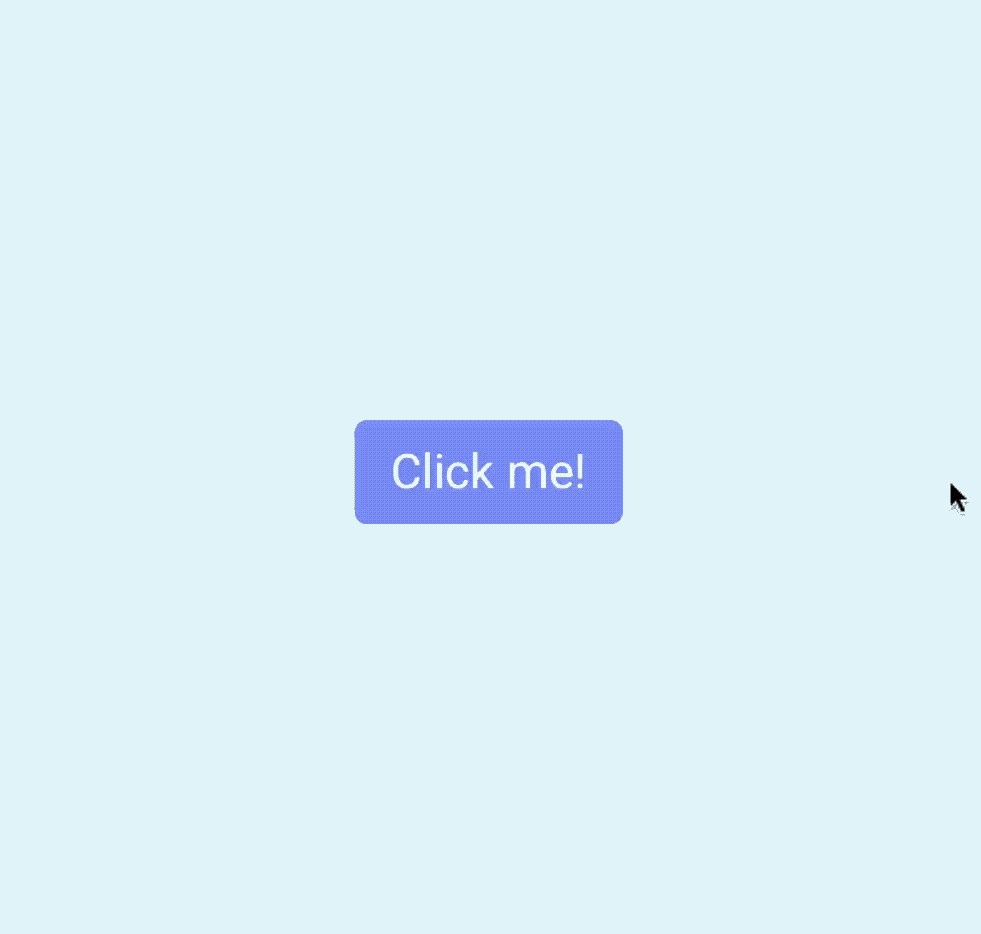

#### Accordion
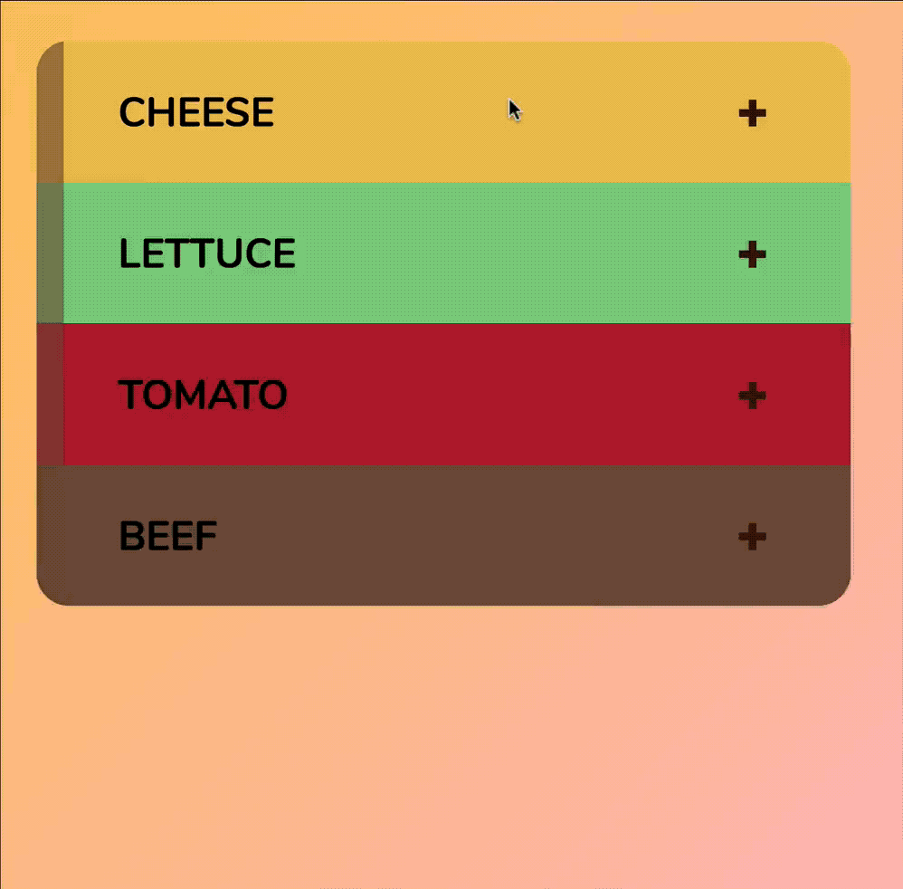

#### Tabbed Component
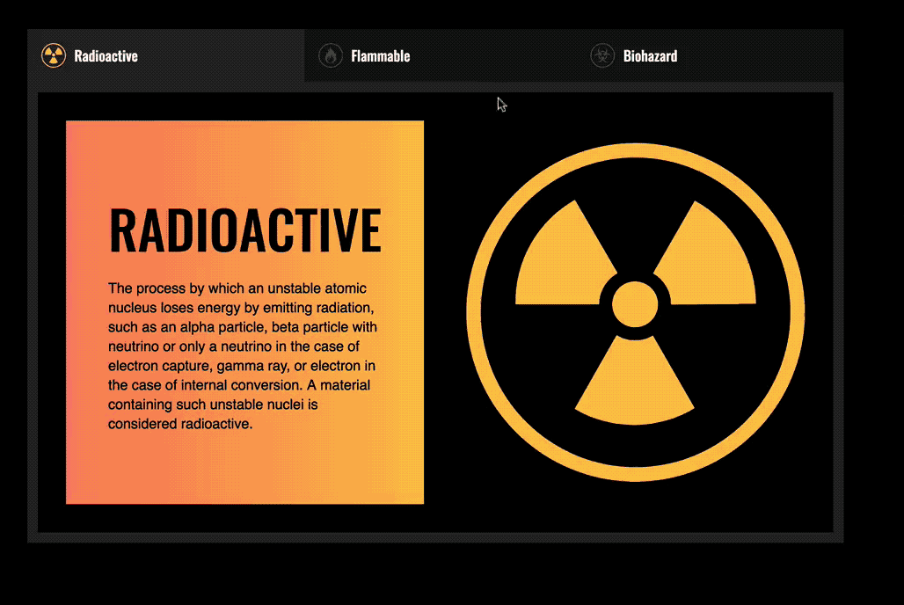

#### Carousel
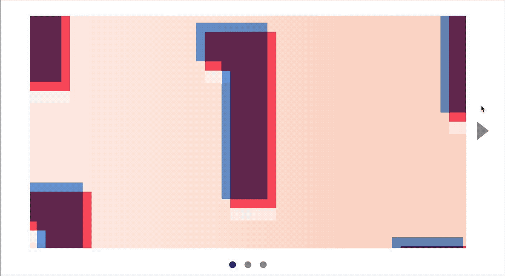

#### Calculator
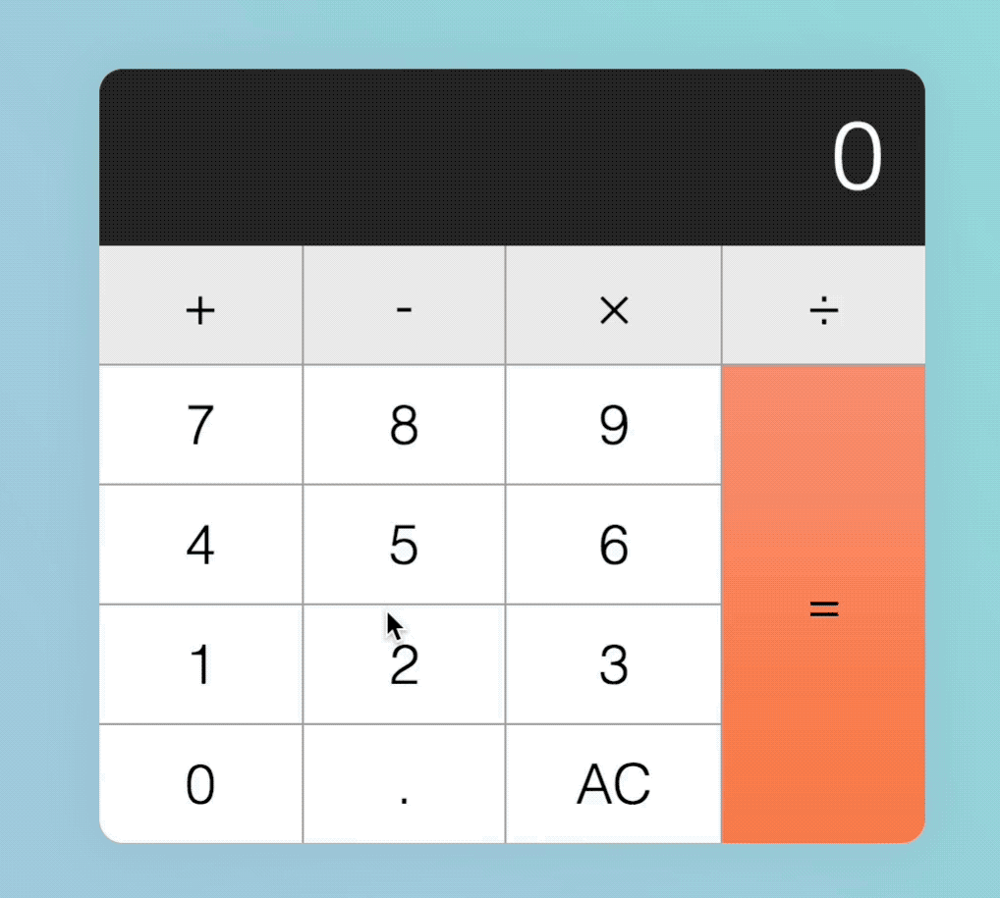

#### Popover
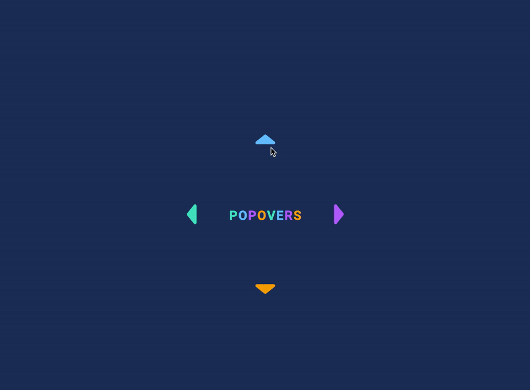

#### Typeahead
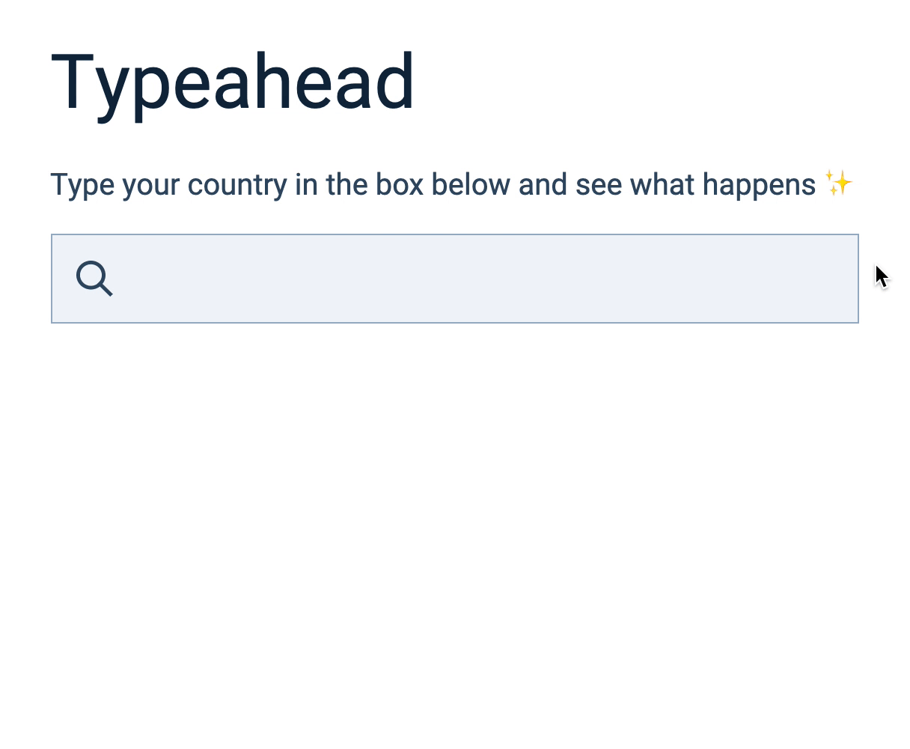

#### Todolist
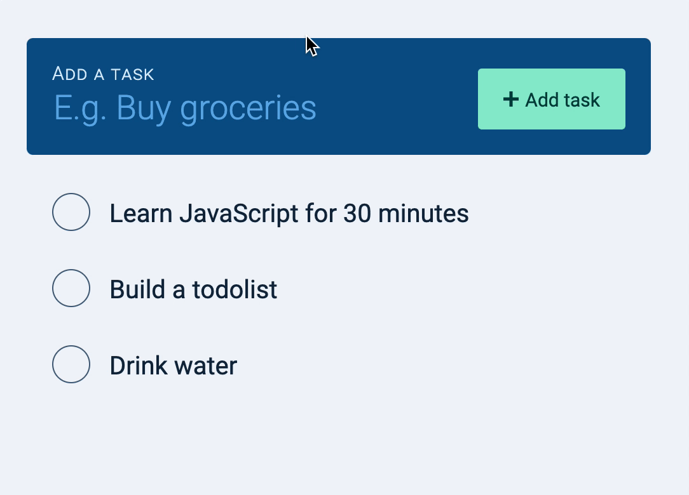 

#### Dota Heroes List
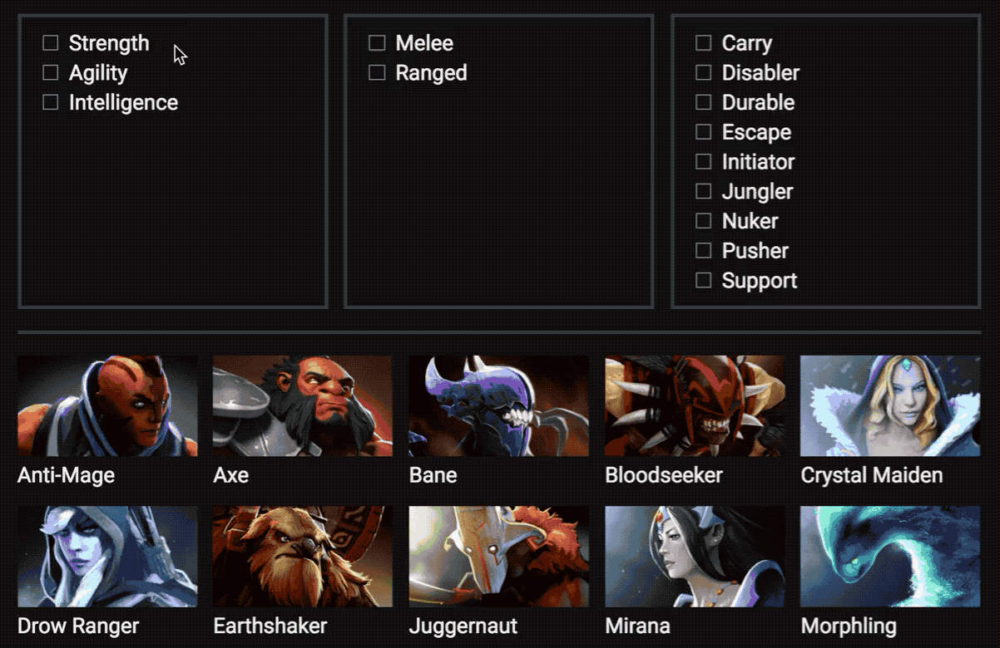

#### Google Maps Component

#### Datepicker
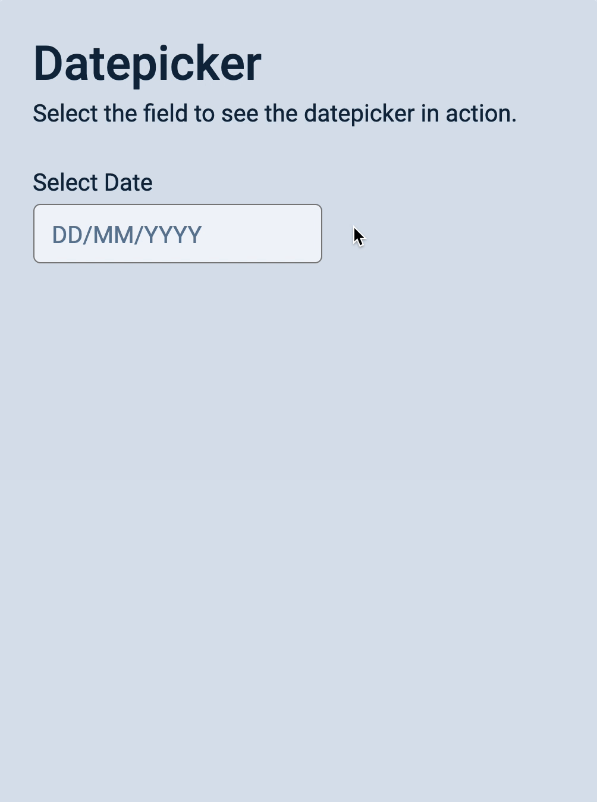

#### Countdown timer

#### Auto-hiding Nav

#### Infinite Scroll

#### Same Page scroll link

#### Infinite scrolling page

#### Scrollspy component

#### Drag and Drop

#### Card generator app
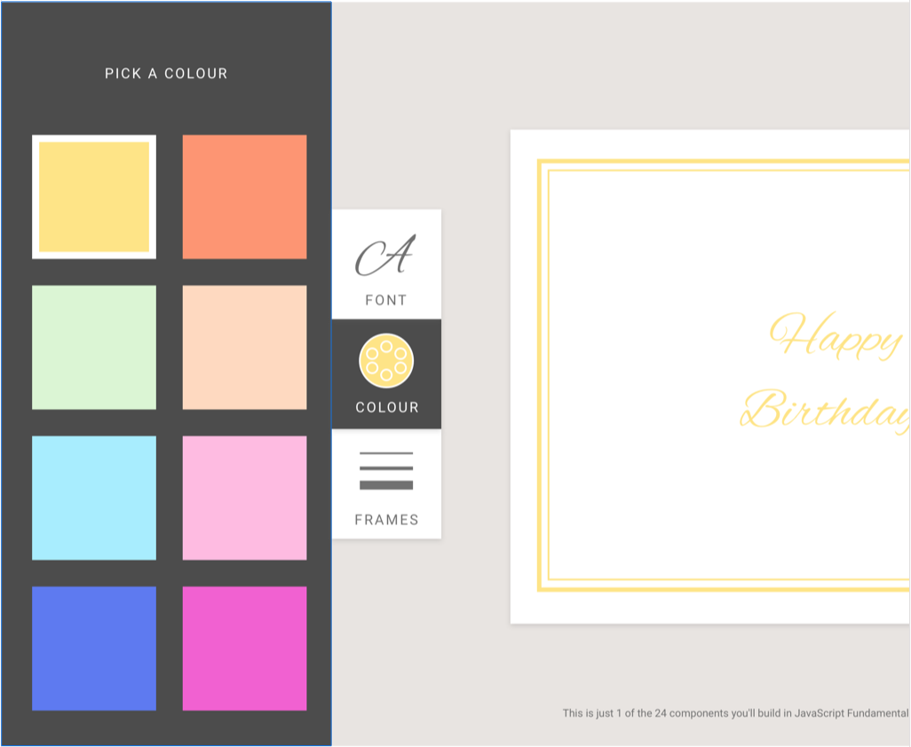